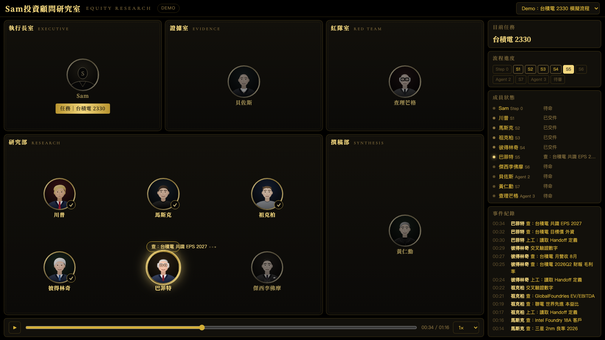
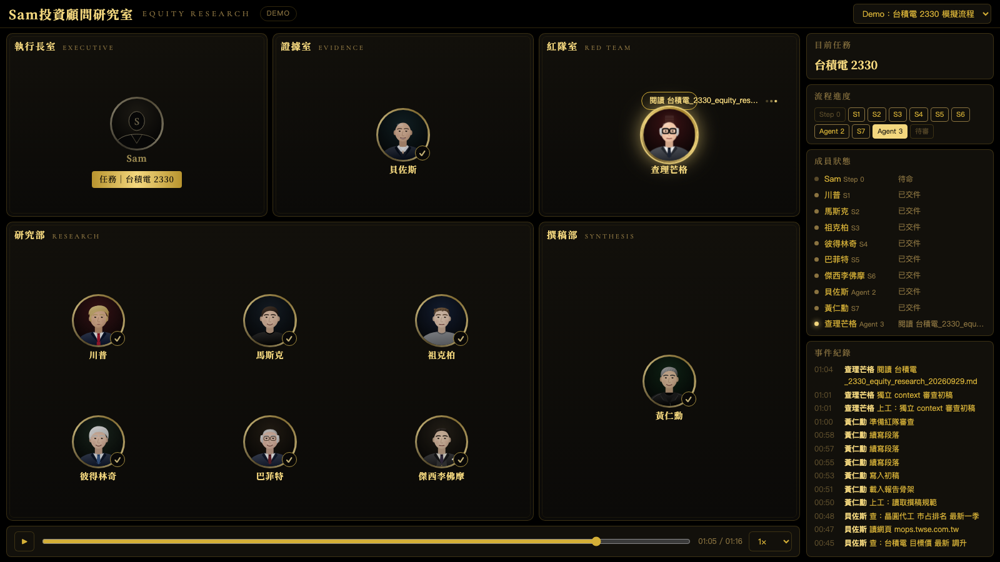
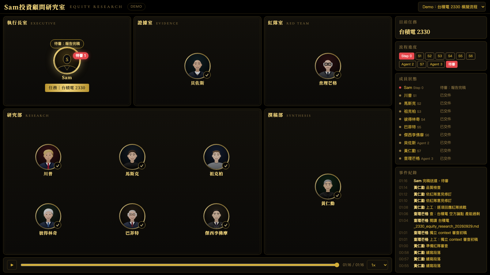

# equity-research-office

**台股財報分析 skill ＋「Sam投資顧問研究室」即時儀表板。**

這個專案包含兩個可以獨立使用、也可以搭配使用的部分：

| 資料夾 | 內容 |
|---|---|
| [`skill/`](skill/) | Claude Code skill `/equity-research-tw`：輸入台股代號，產出可稽核的 Markdown 財報分析報告（3 個 Agent ＋ S1～S7 架構） |
| [`agent-office/`](agent-office/) | 網頁儀表板：把分析流程中的每個角色畫成坐在部門裡的人物肖像，即時顯示誰在做什麼，並可回放整個流程 |

> 本專案為個人研究工具，產出內容僅供研究參考，不構成任何投資建議。

---

## 儀表板畫面

**研究進行中**：輪到誰，誰的肖像就發光，上方對話框顯示正在做的事（查資料、交叉驗證、寫稿…）；做完的人會掛上 ✓。右側是目前任務、流程進度、成員狀態與事件紀錄。



**獨立審查階段**：初稿完成後，紅隊室（查理芒格）以全新 context 對初稿做對抗性複核。



**完稿待審**：報告寫完後，執行長室出現「待審」標記。



### 部門與角色

| 部門 | 角色 | 對應流程 |
|---|---|---|
| 執行長室 | Sam | 統籌者：Step 0 確認輸入、最後待審 |
| 研究部 | 川普／馬斯克／祖克柏／彼得林奇／巴菲特／傑西李佛摩 | S1 市場／S2 競爭／S3 同業／S4 財務／S5 估值／S6 論點與風險 |
| 證據室 | 貝佐斯 | Agent 2 Evidence Curator（彙整、驗證、時效性掃描） |
| 撰稿部 | 黃仁勳 | S7 Synthesis（撰寫報告） |
| 紅隊室 | 查理芒格 | Agent 3 Red Team Reviewer（獨立 context 審查） |

人物肖像為向量插畫，未使用任何真人照片。想換人，只要修改 `agent-office/public/index.html` 開頭的 `ROLE_DEF`。

---

## 快速開始

### 1. 安裝 skill

需要 [Claude Code](https://claude.com/claude-code) 與 Python 3。

```bash
cp -r skill ~/.claude/skills/equity-research-tw
```

在 Claude Code 中執行：

```
/equity-research-tw 2330
```

會先詢問深度模式（Quick／Standard／Deep）與估值方法（只做可比乘數，或另加 DCF），之後依序完成 S1～S6、Evidence Curator、S7 撰稿與紅隊審查，最後把報告存到目前工作目錄的 `outputs/{公司}_{代號}_{日期}/`。流程與設計原則的完整說明見 [`skill/README.md`](skill/README.md)。

### 2. 先用 Demo 看儀表板（不需要跑分析）

需要 Node.js 18 以上，不需要 `npm install`。

```bash
node agent-office/server.mjs
```

瀏覽器開 <http://localhost:5180/?demo=1>，會播放一段模擬的台積電 2330 分析流程（約 1 分 16 秒）。

### 3. 接上真實的分析流程

儀表板靠 Claude Code hooks 收集事件。**只需要在你要跑分析的專案資料夾裡設定，不影響其他專案。**

1. 複製 [`.claude/settings.example.json`](.claude/settings.example.json) 的 `hooks` 區塊到該專案的 `.claude/settings.local.json`（已有其他設定就合併進去，不要整個覆蓋）。
2. 把裡面的 `/ABSOLUTE/PATH/TO/equity-research-office` 改成本專案在你電腦上的絕對路徑。
3. 啟動伺服器：`node agent-office/server.mjs`，瀏覽器開 <http://localhost:5180>。
4. 在該專案資料夾執行 `/equity-research-tw 2330`，畫面會即時更新。

hook 只做「觀察」：在背景執行、不回傳任何內容給 Claude、伺服器沒開時直接略過，不會影響分析結果。事件只會送到本機 `127.0.0.1:5180`，並存在 `agent-office/events/`（已加入 `.gitignore`，不會被提交）。

---

## 儀表板怎麼判斷誰在做事

這個設計**不需要把 S1～S6 拆成獨立的 subagent**。skill 規定每個階段開始時要先讀一份專屬的參考檔，儀表板就監聽「剛讀了哪個檔案」來判斷輪到哪個角色：

| 偵測到的事件 | 判定 |
|---|---|
| 收到 `/equity-research-tw`、Step 0 詢問輸入 | 執行長室：Sam |
| 讀取 `handoffs/market-handoff.md` … `thesis-handoff.md` | 研究部 S1～S6 依序上工 |
| WebSearch／WebFetch／`cross_validate_tw_data.py` | 該分析師頭上顯示「查資料中／交叉驗證」 |
| 讀取 `evidence-curator.md` | 證據室：Agent 2 |
| 讀取 `s7-synthesis.md`、寫入 `*equity_research*.md` | 撰稿部：S7 |
| Task 工具啟動 subagent（SubagentStart／Stop） | 紅隊室：Agent 3 |
| 對話結束且報告已寫入 | 執行長室出現「待審」 |

Agent 1（Data Researcher）是所有 S 共用的檢索方法，不畫成獨立的人，而是顯示在當下分析師頭上。

## 回放

每次分析都會存成 `agent-office/events/{session}.jsonl`。從右上角選單可切換到任一次紀錄，播放列可暫停、拖曳、調整 0.5×～10× 速度。網址參數也可以直接指定：

```
http://localhost:5180/?session=<session_id>&t=0.45&speed=0
```

`t` 為 0～1 的進度位置，`speed=0` 表示暫停。`?demo=1` 為模擬流程。

---

## 專案結構

```
equity-research-office/
├── skill/                     # /equity-research-tw skill（SKILL.md、reference/、scripts/、templates/）
├── agent-office/
│   ├── server.mjs             # 接收事件、SSE 推送、提供回放紀錄（僅用 Node 內建模組）
│   ├── hook.mjs               # Claude Code hook：精簡事件後送到本機伺服器
│   ├── public/index.html      # 儀表板網頁（單一檔案）
│   └── events/                # 事件紀錄（不提交）
├── .claude/settings.example.json   # hooks 設定範例
└── docs/screenshots/          # README 用的畫面截圖
```

## 資料來源與限制

- 財報數字以 FinMind 為主，並用證交所／櫃買中心 OpenAPI 的官方申報資料與法說會媒體報導交叉驗證；未能交叉驗證的數字會在報告的「資料缺口與限制」中揭露。
- 分析師目標價、共識 EPS 等時效敏感數字會逐筆二次查證是否已有更新版本，並在報告附上時效稽核表。
- 網頁儀表板僅顯示流程狀態，不會讀取或顯示報告內容。
