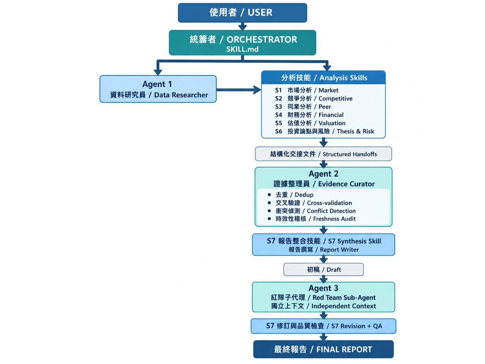

# equity-research-tw

**台股上市櫃公司財報分析報告產生器 — Claude Code skill，3-Agent + S1~S7 架構。**



輸入股票代號或公司名稱，產出一份含公司概況、產業與市場、競爭地位、同業比較、財務分析、估值分析、投資論點、風險與資料限制的完整 Markdown 報告，並附上可稽核的查證軌跡。

## 核心設計原則

- **分析與撰寫分離**：S1～S6 只產出結構化 Evidence（表格、條列、附來源標籤），不寫成品散文；只有 S7 撰寫完整敘事報告。這道鐵律避免各階段各自寫出風格不一、數字未經彙整的段落。
- **數字必須交叉驗證**：關鍵數字走 FinMind + WebSearch 官方公告雙軌確認，不接受單一來源的網頁摘要直接當數字；找得到官方端點時以 TWSE／TPEx OpenAPI 的申報資料仲裁。
- **一致不等於最新**：時效敏感數字（分析師目標價、共識 EPS、市占率等）由 Agent 2 額外做二次查證是否已被更新版本取代。靜態一致性查核與時效性掃描是兩種不同性質的檢查，兩者都要做完。
- **自我審查需要獨立視角**：初稿完成後由 Agent 3 以全新 context（不知道報告怎麼寫出來的）做對抗性複核，避免同一 context 自我審查時的確認偏誤。

## 架構總覽

### 三個底層 Agent

| Agent | 職責 | 執行方式 |
|---|---|---|
| **Agent 1 · Data Researcher** | 供 S1～S6 共用的質化檢索引擎 + 台股量化數據交叉驗證 | 同一 context 內依角色指引執行 |
| **Agent 2 · Evidence Curator** | 彙整六份 Handoff、去重、驗證數字與引用、跨模組衝突偵測（Step 1~3）＋ 時效性掃描（Step 4） | 同一 context 內依角色指引執行 |
| **Agent 3 · Red Team Reviewer** | 對抗性複核：反向論證、未解釋矛盾、過度自信主張、情境測試四類攻擊框架 | **必須用獨立 context**，三個 Agent 中唯一有此要求 |

### 七個分析階段

S1 Market（市場與產業）→ S2 Competitive（競爭態勢）→ S3 Peer（同業比較）→ S4 Financial（財務報表）→ S5 Valuation（財務模型與估值）→ S6 Thesis/Risk（投資論點與風險）→ S7 Synthesis（整合撰寫）

### 執行流程

```
Step 0  輸入確認（股票代號、深度模式 Quick／Standard／Deep）
Step 1  S1～S6 依序執行，各自產出結構化 Handoff
Step 2  Agent 2 Evidence Curator：彙整 → 去重 → 衝突裁決 → 時效性掃描 → 輸出時效稽核表
Step 3  S7 撰寫初稿（漸進寫檔，每次 ≤5,000 字）
Step 3.5 Agent 3 Red Team Reviewer 以獨立 context 複核，S7 對挑戰清單逐項回應
Step 4  S7 品質把關（含自動化檢查腳本）→ 交付 Markdown
```

### 版本沿革

原設計為 4-Agent（Evidence Curator 與 Freshness Auditor 分開），後來檢討發現這兩者雖然檢查性質不同（靜態一致 vs. 時效追新），但不像 Red Team Reviewer 那樣需要獨立 context 才能發揮作用——時效查證只是同一個 context 多做一輪搜尋，任何 context 確實執行都做得到。因此合併為一個 Agent、保留兩個內部步驟，架構從 4-Agent 簡化為 3-Agent，功能不變。詳細沿革記錄在 `reference/evidence-curator.md` 開頭。

同一時期另移除了「S7 超過 18,000 字觸發自動續寫」機制：實測從未正常觸發，唯一一次作動是在額度耗盡時被誤用為逃生口、產出殘缺報告。現行規則改為——S7 若寫到接近 18,000 字，代表 S1～S6 字數預算失控，應退回檢查各階段 Handoff。

## 功能特色與優勢

這個 skill 解決的核心問題：單一 LLM 一次性生成財報分析報告時，即使 prompt 寫得再仔細，仍難以在同一個生成過程裡，同時做到「查證每個數字」「發現數字已過時」「挑戰自己剛寫出的結論」——後者尤其需要獨立於生成過程之外的視角才有效。3-Agent 架構把這些檢查拆成獨立步驟。

- **抓得到「兩個來源一致但都過時」的陷阱**，這是單純比對來源一致性抓不到的。Agent 2 的時效性掃描專門查證時效敏感數字是否已被更新版本取代。實測案例：南亞科技報告曾查到瑞銀 2025 年 11 月的目標價（140 元），若未做時效二次查證會直接誤用這個已被基本面變化推翻的舊數字；聯發科報告則查到摩根士丹利目標價存在多個時間點版本，該步驟主動標記「版本時效未完全確認」，選擇誠實揭露查無最新版本，而非捏造一個數字填滿表格。

- **對抗性複核真的會推翻結論，不只是潤飾措辭**。實測案例：南亞科技初稿原本評等為 BUY，紅隊複核指出 Bear/Base 情境的風險報酬本身不對稱、核心估值假設僅單一來源未交叉驗證，S7 依規則逐項回應後，評等實質下修為「中性偏多」——這不是格式補強，是複核真的動搖並修正了報告的核心判斷。

- **強制列出情境分析的具體假設，不接受「合理假設」帶過**。S5 Valuation Handoff 規定 WACC、成長率、本益比倍數等假設必須逐項附數字，這道結構性關卡讓「跳過情境分析、只列目標價彙整表」這種在時間壓力下容易發生的疏漏不會通過品質把關。

- **版本分歧採並列揭露，而非挑一個宣稱最新**。時效稽核表呈現的是版本區間與各版本的日期／來源，讓讀者看見資料本身的不確定性（例如同期存在 EPS 15.49 與 15.02 兩個版本、市占率 17.7%–24% 的區間），而不是由報告代為挑選一個數字並斷言其為最新。

- **每份報告都附可稽核的查證軌跡，而非只有結論**。「資料完整性與查證紀錄」章節固定包含交叉驗證結果、時效稽核表、紅隊挑戰清單與逐項處理結果，讀者可以自行核實查證與複核是否真的發生過、抓到了什麼問題，而不是只能相信報告自稱「已驗證」。

- **跨章節數值一致性由腳本自動掃描**。`scripts/check_number_consistency.py` 找出同一指標在不同章節出現不同數值的位置，分「高風險（同期間不同值）」與「待確認（期間不同）」兩級；腳本不判斷何者正確，只攤開候選位置供逐一確認。

- **內部流程用語不得滲入正文**。`scripts/validate_equity_report.py` 會檢查讀者導向的正文是否夾雜生成過程用語，並驗證時效稽核表與紅隊清單**是否有實質內容**（而非僅有標題存在）。「結論影響追蹤」等過程性內容一律置於查證紀錄章節，不放在投資論點正文中。

- **架構本身也接受同樣的質疑標準**。4→3-Agent 的簡化不是縮編，而是套用這個 skill 自己對報告要求的同一套標準——「有沒有實測證據支持、還是只是聽起來合理」——回頭檢視自己的設計後所做的修正。

## 目錄結構

| 檔案 | 代理人／階段 | 目的 |
|---|---|---|
| `SKILL.md` | 統籌者（全流程） | 主檔，定義 Step 0～4 完整執行流程與架構總覽 |
| `reference/data-researcher.md` | Agent 1 · Data Researcher | 質化檢索 + 台股量化數據交叉驗證方法論，含 FinMind dataset 使用注意事項 |
| `reference/evidence-curator.md` | Agent 2 · Evidence Curator | 證據彙整、去重、跨模組衝突偵測（「代理人交鋒」，Step 1~3）＋ 時效性掃描（Step 4，原 Freshness Auditor 職責） |
| `reference/red-team-agent.md` | Agent 3 · Red Team Reviewer | 對抗性複核四類攻擊框架、紅隊挑戰清單格式 |
| `reference/s7-synthesis.md` | S7 · Synthesis | 報告組裝（漸進寫檔，每次 ≤5,000 字）、品質把關清單、Markdown 交付流程（含選配的 Word 轉換方式） |
| `reference/handoffs/*.md` | S1～S6 六個分析模組 | 各模組的結構化輸出格式定義（Source Notes 標籤前綴、欄位結構） |
| `reference/personas/competitive-analyst.md` | S2 · Competitive（選用） | 護城河評分等競爭分析方法論深度參考，僅在資訊不足時讀取 |
| `templates/final_report_template.md` | S7 · Synthesis | 最終報告骨架，含時效稽核表／紅隊挑戰清單／結論影響追蹤三個子章節位置 |
| `scripts/cross_validate_tw_data.py` | Agent 1 · Data Researcher | FinMind API 資料抓取與數值交叉比對工具 |
| `scripts/validate_equity_report.py` | S7 · 品質把關 | 財報分析報告專屬驗證腳本：章節完整性、佔位符、引用／參考資料對應、URL 完整性、時效稽核表與紅隊清單**是否有實質內容**（非僅標題存在）、讀者導向正文是否夾雜內部流程用語 |
| `scripts/check_number_consistency.py` | S7 · 品質把關 | 跨章節數值一致性檢查：找出同一指標出現多個不同數值的位置，分「高風險（同期間不同值）」與「待確認（期間不同）」兩級。不判斷何者正確，只攤開候選位置供逐一確認 |

## 使用方式

在 Claude Code 裡執行 `/equity-research-tw <股票代號或公司名稱>`，或以自然語言描述「幫我分析台積電(2330)的財報」觸發。

## 資料來源

- 質化資訊：WebSearch（產業新聞、法說會報導）
- 量化數據（主要）：[FinMind](https://finmind.github.io/)（免費 API，財務報表／資產負債表／現金流量表／月營收／股價／本益比）
- 量化數據（次要，選用）：[FinLab](https://ai.finlab.tw/)（需自行設定 API token）
- 官方仲裁：[TWSE OpenAPI](https://openapi.twse.com.tw/)（上市公司）／[TPEx OpenAPI](https://www.tpex.org.tw/openapi/)（上櫃公司）——免註冊、免 token 的官方申報財報結構化資料，優先於人工核對；找不到對應端點時才退回公開資訊觀測站（MOPS）網頁人工核對

## 已知限制

- 交叉驗證主要依賴 FinMind + WebSearch 官方公告雙軌確認，TWSE／TPEx OpenAPI 官方仲裁多數端點只回傳當期／前一日快照，不支援歷史區間查詢
- 財報資料庫（FinMind）可能落後公司實際法說會公告 1-2 季，需搭配 WebSearch 查證最新一季數字
- EV/EBITDA、FCF Yield 等指標需額外的 EBITDA 拆解資料，目前尚未內建自動計算
- 時效敏感數字（分析師目標價、共識 EPS）本質上會隨時間失效，報告僅能保證產出當下的查證結果

## 引用來源

來源：
Weizhena/Deep-Research-skills
具體用了什麼：
agents/web-search-agent.md + web-search-modules/（5個搜尋策略模組)，直接被 reference/data-researcher.md 引用，當作 Agent 1 的質化檢索引擎

來源：
199-biotechnologies/claude-deep-research-skill
具體用了什麼：
report-assembly.md（逐段寫檔手法）、quality-gates.md（anti-hallucination checklist）、scripts/verify_citations.py／evidence_store.py／citation_manager.py／verify_claim_support.py／source_evaluator.py——構成 S7 跟 Agent 2 Evidence Curator 的骨幹

來源：
awesome-claude-code-subagents/categories/10-research-analysis/
具體用了什麼：
competitive-analyst.md persona（已複製進 repo 的 reference/personas/）
